<div align="center">

# tasknull

**Prove you finished the work. Hide who you are.**

Anonymous, nullifier-backed proof-of-completion for on-chain bounties — settled on Solana.
This repository is the **`tasknull` command-line tool** and how to use it.

[](https://taksnull.xyz)
[](https://taksnull.xyz/docs/)
[](https://x.com/TaskNull)
[](https://nodejs.org)
[](LICENSE)
[](#contributing)

<br/>



</div>

---

## What is this?

`tasknull` turns a completed bounty into a cryptographic receipt. A reviewer can confirm the work
is real and that the claim can't be spent twice — **without ever learning which wallet did it.**

Today, claiming a bounty usually forces a choice: either you attach your wallet to the payout for
everyone to trace, or your contribution can't be trusted. `tasknull` adds a third path —
**provable completion with an unlinkable identity** — built from three primitives: hiding
**commitments**, one-way **nullifiers**, and signed **proofs**.

This repository contains the **CLI** only. The website and the full, multi-page documentation live
at **[taksnull.xyz](https://taksnull.xyz)** → **[taksnull.xyz/docs](https://taksnull.xyz/docs/)**.

> **Status — v0.1 reference implementation.** The cryptography (identity, commitments, nullifiers,
> signatures, double-claim prevention) is real and runs locally today. On-chain settlement on Solana
> is **simulated locally** until the `$TNULL` program launches (mint **TBA**).

## Contents

- [Highlights](#highlights)
- [Why tasknull](#why-tasknull)
- [Quick start](#quick-start)
  - [1. Requirements](#1-requirements)
  - [2. Install](#2-install)
  - [3. Create your identity](#3-create-your-identity)
  - [4. Prove you finished a bounty](#4-prove-you-finished-a-bounty)
  - [5. Verify and settle](#5-verify-and-settle)
- [Command reference](#command-reference)
- [Understanding a proof](#understanding-a-proof)
- [How it works](#how-it-works)
- [Example session](#example-session)
- [Where your data lives](#where-your-data-lives)
- [Security & privacy](#security--privacy)
- [What tasknull is — and isn't](#what-tasknull-is--and-isnt)
- [Roadmap](#roadmap)
- [Project layout](#project-layout)
- [Contributing](#contributing)
- [Support](#support)
- [FAQ](#faq)
- [Disclaimer](#disclaimer)
- [License](#license)

## Highlights

| | Feature | Description |
|---|---|---|
| ✓ | **Verifiable completion** | Every claim carries a proof that the bounty's criteria were met. Reviewers check the math, not your reputation. |
| ∅ | **Unlinkable identity** | The payout wallet and the proof are cryptographically separated. A verifier learns *"valid hunter"*, never *which* hunter. |
| ⊘ | **No double-claims** | Each claim emits a one-way **nullifier**. Reuse the same solution twice and the second nullifier collides — the claim is rejected. |
| ⚡ | **Zero dependencies** | Pure Node.js standard library (`crypto`). Nothing to audit but the source you can read in minutes. |
| 🔌 | **Offline by design** | Everything runs locally. Your secret never leaves the machine and nothing is sent over the network. |

## Why tasknull

People who ship sensitive work quietly need to get paid without revealing who they are:

- **Security researchers** — claim a disclosure bounty without tying the patch (or the payout) to a real name or employer.
- **Freelance hunters** — build a track record through stable nullifiers while keeping every wallet single-use and clean.
- **DAO contributors** — let a treasury reward completed work on-chain without a public map of who did what for whom.

## Quick start

### 1. Requirements

- **Node.js 18 or newer** — check with `node -v`
- **git**

### 2. Install

```bash
git clone https://github.com/tasknull/tasknull.git
cd tasknull/cli
npm install -g .          # adds the global `tasknull` command
```

Check it works:

```bash
tasknull --version       # → tasknull v0.1.0
```

> Don't want a global install? Run it directly: `node bin/tasknull.js --help`

### 3. Create your identity

This generates a secret + signing keys, stored locally in `~/.tasknull`. Your secret never leaves
your machine.

```bash
tasknull init
```

### 4. Prove you finished a bounty

Point at your solution file and a **fresh** payout address you control:

```bash
echo "my fix for the reentrancy bug" > solution.txt

tasknull prove \
  --bounty zk-audit-114 \
  --file solution.txt \
  --to 7xKXtg2CW87d97TXJSDpbD5jBkheTqA83TZRuJosgAsU \
  --out proof.json
```

This writes `proof.json` — a signed proof containing a one-way **nullifier**.

### 5. Verify and settle

Anyone can verify the proof; settling burns the nullifier so the work can't be claimed again.

```bash
tasknull verify proof.json     # → ✓ VALID
tasknull claim proof.json      # → ✓ settled (nullifier burned)
tasknull claim proof.json      # → ✗ rejected (no double-claims)
```

That's the whole lifecycle.

## Command reference

| Command | What it does |
|---|---|
| `tasknull init` | Create your local identity (secret + Ed25519 keys). `--force` to overwrite. |
| `tasknull whoami` | Print your public Solana address. |
| `tasknull commit --bounty <id> --file <path>` | Publish a hiding commitment for a solution. |
| `tasknull prove --bounty <id> --file <path> --to <SOL_ADDR>` | Emit a signed proof + nullifier. Options: `--out`, `--scope`, `--reward`. |
| `tasknull verify <proof.json>` | Verify signature, structure, nullifier freshness, scope. |
| `tasknull claim <proof.json>` | Settle a proof — burns the nullifier locally. |
| `tasknull spent` | List nullifiers spent on this machine. |

Run `tasknull --help` any time. Full guides: **[taksnull.xyz/docs](https://taksnull.xyz/docs/)**.

## Understanding a proof

`tasknull prove` produces a self-contained JSON document. Anyone can verify it offline:

```json
{
  "version": 1,
  "bounty": "zk-audit-114",
  "scope": null,
  "reward": null,
  "solutionHash": "0b2038ee…7e4bc",
  "commitment": "b65c3b9f…2e54",
  "nullifier": "b2cff474…e0c1",
  "payout": "7xKXtg2CW87d97TXJSDpbD5jBkheTqA83TZRuJosgAsU",
  "publicKey": "BrvFkjhE5yZWokxtFU6A8eFFfDeRLygWxxLyD9FTCkBJ",
  "createdAt": "2026-06-14T08:05:21.321Z",
  "signature": "…"
}
```

| Field | Meaning |
|---|---|
| `solutionHash` | SHA-256 of your solution file — proves *what* you submitted without revealing it. |
| `commitment` | Binds the solution to the bounty under your secret. |
| `nullifier` | One-way mark; reused only if the same identity claims the same bounty again. |
| `payout` | Fresh address the reward releases to — unlinked to your identity key. |
| `signature` | Ed25519 signature over the whole payload; tampering invalidates it. |

## How it works

- **Identity** — a 32-byte secret + Ed25519 keypair, generated and stored locally.
- **Commitment** — `SHA256(bounty ‖ SHA256(solution) ‖ secret)` binds your work without revealing it.
- **Nullifier** — `SHA256("nullifier" ‖ secret ‖ bounty)`: deterministic per `(secret, bounty)`, so the
  same work can't be claimed twice, yet it leaks nothing about your secret.
- **Proof** — a signed JSON object; verification re-checks the Ed25519 signature over the exact
  payload, so any tampering is caught.

Read the full explanation in the [docs → Core concepts](https://taksnull.xyz/docs/concepts.html).

## Example session

```text
$ tasknull init
✓ identity created  → ~/.tasknull/identity.json
  Solana address  BrvFkjhE5yZWokxtFU6A8eFFfDeRLygWxxLyD9FTCkBJ

$ tasknull prove --bounty zk-audit-114 --file solution.txt --to 7xKX…osgAsU --out proof.json
✓ proof written  → proof.json
  nullifier  b2cff4743741e95bf57296e7…

$ tasknull verify proof.json
  ✓ bounty membership / commitment
  ✓ signature integrity
  ✓ nullifier unspent
  ✓ scope & reward match
✓ VALID — proof checks out

$ tasknull claim proof.json
✓ settled — nullifier burned, reward released to 7xKX…osgAsU

$ tasknull claim proof.json
  ✗ nullifier unspent
✗ cannot settle — proof invalid or nullifier already spent
```

## Where your data lives

State is stored under `~/.tasknull` (override with the `TASKNULL_HOME` env var):

| File | Contents |
|---|---|
| `identity.json` | Your secret + Ed25519 keys. **Keep private and back it up — there is no recovery.** |
| `spent.json` | Nullifiers burned on this machine. |

## Security & privacy

- **Your secret stays local.** It is generated by `tasknull init`, written only to `~/.tasknull`,
  and never transmitted.
- **Back up `identity.json`.** Losing it means losing the ability to prove with that identity.
- **Use a fresh payout address** for each claim to keep payouts unlinkable.
- **Honest scope.** The v0.1 CLI provides commitments, nullifiers, signature integrity, and
  double-claim prevention. **Full zero-knowledge unlinkability** (ring / membership proofs that hide
  *which* registered member signed) is part of the protocol's design and lands with the ZK circuit —
  it is not in this reference release. Plan your operational privacy accordingly.
- Found a vulnerability? Please report it privately via [X (@TaskNull)](https://x.com/TaskNull)
  rather than opening a public issue.

## What tasknull is — and isn't

**It is:**

- a small, readable reference for commit → prove → settle with nullifiers;
- a working local tool you can use and integrate against today;
- MIT-licensed and dependency-free.

**It isn't (yet):**

- a deployed on-chain protocol — settlement is simulated locally until the Solana program ships;
- a full zero-knowledge system — that arrives with the ZK circuit;
- custody software — it never holds your funds or keys for you.

## Roadmap

- [x] Local identity, commitments, and one-way nullifiers
- [x] Signed proofs + offline verification
- [x] Local double-claim prevention
- [ ] On-chain nullifier registry + settlement on **Solana**
- [ ] `$TNULL` reward program
- [ ] Zero-knowledge membership proofs (full unlinkability)
- [ ] Hosted verifier API + browser verifier

## Project layout

```
tasknull/                 (main branch — this repo)
├─ cli/
│  ├─ bin/tasknull.js      # executable entry point
│  ├─ src/
│  │  ├─ cli.js            # argument parsing + commands
│  │  ├─ crypto.js         # ed25519 / sha256 / nullifier / commitment
│  │  └─ store.js          # local identity + spent-nullifier registry
│  ├─ package.json
│  └─ README.md            # CLI docs
├─ assets/cli-demo.svg     # the animated terminal demo above
├─ LICENSE
└─ README.md
```

The website and documentation live on the **`gh-pages`** branch and are served at
[taksnull.xyz](https://taksnull.xyz).

## Contributing

Contributions are welcome.

1. Fork the repo and create a branch: `git checkout -b my-change`.
2. Keep the CLI **dependency-free** — standard library only.
3. Test your change end to end (`init` → `prove` → `verify` → `claim`).
4. Open a pull request describing the change and why.

For larger ideas, open an issue first so we can align on direction.

## Support

- 📚 Docs — [taksnull.xyz/docs](https://taksnull.xyz/docs/)
- 🐛 Issues — [github.com/tasknull/tasknull/issues](https://github.com/tasknull/tasknull/issues)
- 𝕏 — [@TaskNull](https://x.com/TaskNull)

## FAQ

**Is tasknull live on-chain?**
Not yet. The CLI runs locally today; on-chain settlement on Solana ships with the `$TNULL` program.

**Does it send anything over the network?**
No. Everything runs locally and your secret never leaves your machine.

**What stops someone claiming the same bounty twice?**
The nullifier — it's deterministic per `(secret, bounty)`, so a repeat claim collides with the first.

**What if I lose `identity.json`?**
There is no recovery. Back up the `~/.tasknull` folder and keep it private.

**Which networks are supported?**
tasknull targets **Solana** for settlement and rewards.

## Disclaimer

`$TNULL` is an experimental utility token and this software is provided **"as is"**, without
warranties of any kind. Nothing here is financial, legal, or investment advice. Digital assets are
highly volatile and you may lose the entire value of your funds. Use at your own risk.

## License

Released under the [MIT License](LICENSE).

<div align="center">
<sub>© 2026 tasknull · proof of completion, not identity</sub>
</div>
