<div align="center">



**Prove you finished the work. Hide who you are.**

Anonymous, nullifier-backed proof-of-completion for on-chain bounties — settled on Base.

[](https://tasknull.art)
[](https://x.com/TaskNull)
[](cli/)
[](https://base.org)
[](LICENSE)

</div>

---

## Overview

**tasknull** turns a completed bounty into a cryptographic receipt. Reviewers can confirm the
work is real and that the claim cannot be spent twice — **without ever learning which wallet did it.**

Today, claiming a bounty usually means doxxing yourself: either your wallet is attached to the
payout for everyone to trace, or your contribution can't be trusted. tasknull adds a third path:
**provable completion, unlinkable identity.**

This repository contains the **`tasknull` CLI** (the tool you actually use) and the project's
**website**.

> **Status:** the CLI is a working **v0.1 reference implementation** — the cryptography
> (identity, commitments, nullifiers, signatures, double-claim prevention) is real and runs
> locally. On-chain settlement on Base is **simulated locally** until the `$TNULL` contract
> launches (contract address **TBA**).

## Table of contents

- [Quick start (use it now)](#quick-start-use-it-now)
- [Install the CLI](#install-the-cli)
- [CLI commands](#cli-commands)
- [How it works](#how-it-works)
- [Why](#why)
- [Key features](#key-features)
- [The $TNULL token](#the-tnull-token)
- [Project structure](#project-structure)
- [The website](#the-website)
- [Tech stack](#tech-stack)
- [Links](#links)
- [Disclaimer](#disclaimer)
- [License](#license)

## Quick start (use it now)

Requires **Node.js ≥ 18**.

```bash
git clone https://github.com/tasknull/tasknull.git
cd tasknull/cli
npm install -g .          # adds the `tasknull` command (or use: node bin/tasknull.js)

# create your identity — your secret never leaves this machine
tasknull init

# prove you finished a bounty, payable to a fresh address you control
echo "my fix for the reentrancy bug" > solution.txt
tasknull prove --bounty zk-audit-114 --file solution.txt \
  --to 0x1111111111111111111111111111111111111111 --out proof.json

# anyone can verify it — then settling burns the nullifier
tasknull verify proof.json
tasknull claim proof.json

# try to claim the same work twice → rejected (no double-claims)
tasknull claim proof.json
```

Full CLI docs: **[cli/README.md](cli/README.md)**.

## Install the CLI

```bash
# from the cloned repo
cd tasknull/cli
npm install -g .                 # global `tasknull` command

# or run without installing
node bin/tasknull.js --help
```

The CLI has **zero dependencies** (only Node's built-in `crypto`). State is stored in
`~/.tasknull` (override with the `TASKNULL_HOME` env var).

## CLI commands

| Command | What it does |
|---|---|
| `tasknull init` | Create your local identity (`secret` + Ed25519 keys). |
| `tasknull whoami` | Print your public identity commitment. |
| `tasknull commit --bounty <id> --file <path>` | Publish a hiding commitment for a solution. |
| `tasknull prove --bounty <id> --file <path> --to <0x…>` | Emit a signed proof + one-way nullifier (`--out`, `--scope`, `--reward`). |
| `tasknull verify <proof.json>` | Verify signature, structure, nullifier freshness, scope. |
| `tasknull claim <proof.json>` | Settle a proof — burns the nullifier locally. |
| `tasknull spent` | List nullifiers spent on this machine. |

## How it works

Three steps, one CLI. The signing happens entirely on your machine — no coordinator, no custodian, no account.

```bash
# 0. one-time — create your local identity
tasknull init

# 1. COMMIT — lock your solution to a bounty's criteria
tasknull commit --bounty zk-audit-114 --file ./solution.txt

# 2. PROVE — derive a nullifier from your secret and sign the completion proof
tasknull prove --bounty zk-audit-114 --file ./solution.txt --to 0xYourFreshAddress --out proof.json

# 3. SETTLE — anyone verifies; claiming burns the nullifier so it can't be reused
tasknull verify proof.json
tasknull claim proof.json
```

Under the hood:

- **Identity** — a 32-byte secret + Ed25519 keypair, generated and stored locally.
- **Commitment** — `SHA256(bounty ‖ SHA256(solution) ‖ secret)` binds your work without revealing it.
- **Nullifier** — `SHA256("nullifier" ‖ secret ‖ bounty)`: deterministic per `(secret, bounty)`, so
  the same work can't be claimed twice, yet it leaks nothing about your secret.
- **Proof** — a signed JSON object; verification re-checks the Ed25519 signature over the exact
  payload, so any tampering is caught.

## Why

People who ship sensitive work quietly need to get paid without revealing who they are:

- **Security researchers** — claim a disclosure bounty without tying the patch (or the payout) to a real name or employer.
- **Freelance hunters** — build a track record through stable nullifiers while keeping every wallet single-use and clean.
- **DAO contributors** — let a treasury reward completed work on-chain without a public map of who did what for whom.

## Key features

| | Feature | Description |
|---|---|---|
| ✓ | **Verifiable completion** | Every claim carries a proof that the bounty's criteria were met. Reviewers check the math, not your reputation. |
| ∅ | **Unlinkable identity** | The payout wallet and the proof are cryptographically separated. A verifier learns *"valid hunter"*, never *which* hunter. |
| ⊘ | **No double-claims** | Each claim emits a one-way **nullifier**. Reuse the same solution twice and the second nullifier collides — the claim is rejected. |

## The $TNULL token

`$TNULL` is the bounty reward layer, designed to live on **Base**. Reward pools are funded in
`$TNULL` and pay out to the proof, never to a doxxable signer — the privacy model holds by construction.

| Allocation | Share |
|---|---:|
| Bounty reward pool | 60% |
| Liquidity · Base | 20% |
| Protocol & CLI dev | 12% |
| Verifier infra | 8% |

- **Network:** Base (L2)
- **Contract:** `TBA` — announced at launch. Always verify the official address before transacting.

## Project structure

```
tasknull/
├─ cli/                    # the `tasknull` command-line tool (Node, zero deps)
│  ├─ bin/tasknull.js      #   executable entry point
│  ├─ src/
│  │  ├─ cli.js            #   argument parsing + commands
│  │  ├─ crypto.js         #   ed25519 / sha256 / nullifier / commitment
│  │  └─ store.js          #   local identity + spent-nullifier registry
│  ├─ package.json
│  └─ README.md            #   full CLI docs
├─ index.html              # Landing page (hero, sections, 3D background)
├─ terms.html              # Terms of Use
├─ privacy.html            # Privacy Policy
├─ assets/                 # logo, favicon, OG image, animated README banner
├─ build/                  # asset-generation scripts (logos, OG, banner)
├─ .gitignore
├─ LICENSE
└─ README.md
```

## The website

The marketing site lives at the repo root as a single static `index.html` (plus `terms.html`
and `privacy.html`). It's published via **GitHub Pages** at **[tasknull.art](https://tasknull.art)** — every push to `main` redeploys.

Run it locally:

```bash
# from the repo root — it's a static site, no build step needed
python -m http.server 8000
# then open http://localhost:8000
```

> The hero's 3D background loads Three.js from a CDN, so an internet connection is needed for that effect.

Rebuild generated images from `assets/logo.jpg` with the scripts in `build/`
(`node build/genfav.js`, `python build/og.py`, `python build/banner.py`).

## Tech stack

- **CLI** — Node.js (≥ 18), zero dependencies, standard `crypto` (Ed25519 + SHA-256).
- **Website** — static `index.html`, custom CSS, vanilla JS, [Three.js](https://threejs.org) for the 3D background.
- **Hosting** — [GitHub Pages](https://pages.github.com) (custom domain).
- **Asset tooling** — [sharp](https://sharp.pixelplumbing.com) (Node) and [Pillow](https://python-pillow.org) (Python).

## Links

- 🌐 Website — https://tasknull.art
- 𝕏 / Twitter — https://x.com/TaskNull
- ⛓ Base — https://base.org

## Disclaimer

`$TNULL` is an experimental utility token and this software is provided **"as is"**, without
warranties of any kind. Nothing in this repository or on the website is financial, legal, or
investment advice. Digital assets are highly volatile and you may lose the entire value of your
funds. Always verify the official contract address before transacting, and use at your own risk.

## License

Released under the [MIT License](LICENSE).

<div align="center">
<sub>© 2026 tasknull · proof of completion, not identity</sub>
</div>
